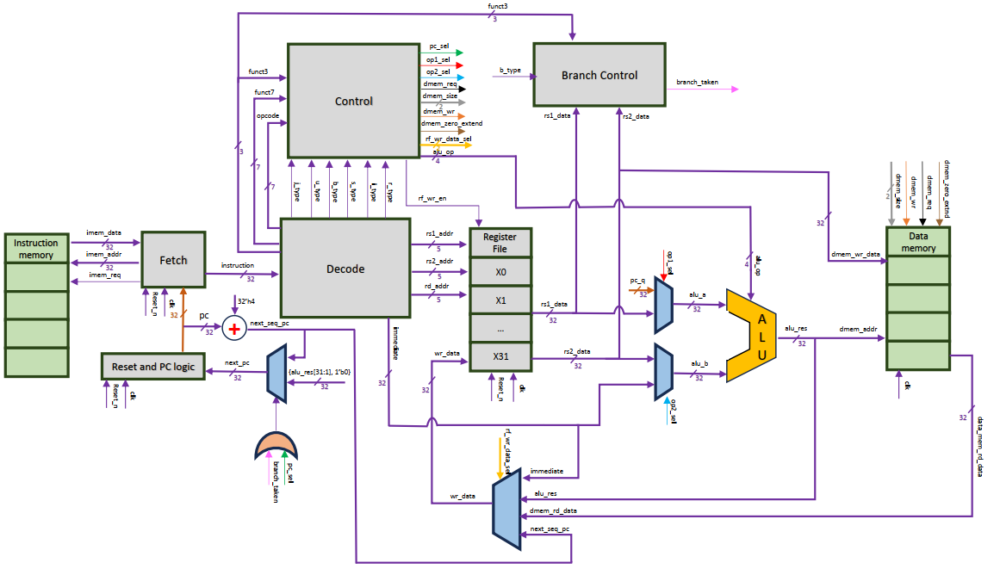
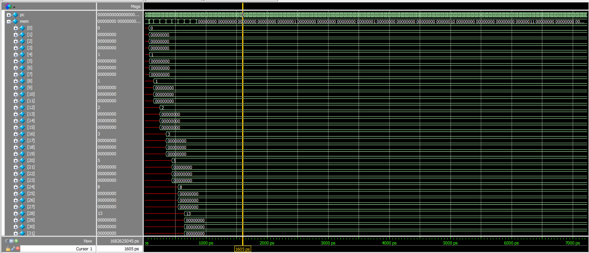

<h1 align="center">RISC-V RV32I Single-Cycle CPU</h1>

<p align="center">
  A 32-bit RISC-V processor implemented using SystemVerilog and RTL design principles
</p>

A SystemVerilog implementation of a **32-bit RISC-V RV32I single-cycle processor**. The project demonstrates the major components involved in a processor datapath, including instruction fetching, decoding, register operations, ALU computation, memory access, and control logic.

---

## 🚀 Overview

This project explores the internal operation of a RISC-V processor by implementing its datapath and control logic using modular SystemVerilog components.

The processor follows a **single-cycle architecture**, where each instruction completes its execution within one clock cycle.

The project focuses on understanding the relationship between the **RISC-V instruction set architecture (ISA)** and its corresponding hardware implementation.

---

## 🎯 Project Objectives

* Study the **RISC-V RV32I instruction set architecture**
* Understand instruction formats and bit-level decoding
* Implement the processor datapath using SystemVerilog RTL
* Design and integrate the major CPU functional units
* Simulate instruction execution and analyze processor behavior
* Understand how software instructions are translated into hardware operations

---

## ⚙️ Features

* **ISA:** RISC-V RV32I
* **Architecture:** Single-Cycle
* **HDL:** SystemVerilog
* **Simulation:** ModelSim / QuestaSim

### ✔ Supported Instruction Categories

* R-type instructions
* I-type arithmetic instructions
* Load instructions
* Store instructions
* Branch instructions
* JAL and JALR
* LUI
* AUIPC

### ✔ Memory

* Instruction memory
* Data memory
* Byte-addressable memory organization

---

## 🧠 CPU Architecture

The processor is divided into multiple functional modules to keep the RTL design organized and easier to verify.

Major components include:

* Program Counter
* Instruction Memory
* Instruction Fetch Logic
* Instruction Decoder
* Register File
* Immediate Generator
* ALU
* Control Unit
* Branch Control
* Data Memory
* Write-Back Logic
* Top-Level CPU Module

Common instruction definitions, ALU operations, and control signals are organized in the SystemVerilog package:

```text
risc_pkg.sv
```

This modular structure makes the design easier to understand, simulate, debug, and extend.

---

## 🖼️ CPU Datapath

<p align="center">
  
</p>

The datapath connects the instruction-fetch, decode, execute, memory, and write-back operations required for RV32I instruction execution.

---

## 📁 Project Structure

```bash
rtl/        # SystemVerilog RTL modules
tb/         # Simulation testbench
mem/        # Program and machine-code files
sim/        # ModelSim/Questa simulation scripts
docs/       # Architecture diagrams and simulation results
```

---

## 🧪 Simulation

### ▶ Running the Simulation

Open the simulation directory and execute:

```bash
cd sim
vsim -do run.do
```

### 🔍 Signals to Analyze

During simulation, useful signals to observe include:

* Program Counter
* Current instruction
* Register-file read/write operations
* ALU inputs and output
* Control signals
* Memory read/write operations
* Register write-back
* Branch decisions

Waveform analysis can be used to verify that instructions propagate correctly through the processor datapath.

---

## 📊 Simulation Results

### Fibonacci Program

The processor can be tested using a Fibonacci sequence program to verify arithmetic operations, register transfers, control flow, and memory interactions.

<p align="center">
  
</p>

---

## 💻 Example Program

### Fibonacci Sequence Generator

The example program demonstrates iterative computation using RISC-V instructions.

The program contains:

* RISC-V assembly instructions
* Corresponding machine-code representation
* Memory initialization file
* Simulation waveform

The resulting execution can be examined through the processor's register and memory signals.

---

## 🔧 Requirements

To simulate the processor, you need:

* ModelSim or QuestaSim
* SystemVerilog-compatible simulator
* Basic understanding of RISC-V assembly and RTL design

---

## 🧭 Possible Extensions

Future improvements could include:

* Five-stage pipelined RISC-V architecture
* Data and control hazard handling
* Forwarding and stall mechanisms
* Cache implementation
* FPGA deployment
* Additional verification programs
* Performance analysis

---

## 📜 License

This project is distributed under the **MIT License**.

Please retain the original project's license and attribution when redistributing or modifying the source code.

---

## 👨‍💻 Author

**Rahul Goswami**

Electronics & Instrumentation Engineering Student

---

## ⭐ Learning Focus

This project provides practical exposure to **RISC-V architecture, SystemVerilog RTL design, processor datapaths, control logic, instruction decoding, and hardware simulation**.

It serves as a foundation for further exploration of processor architecture, pipelining, verification, and digital hardware design.
